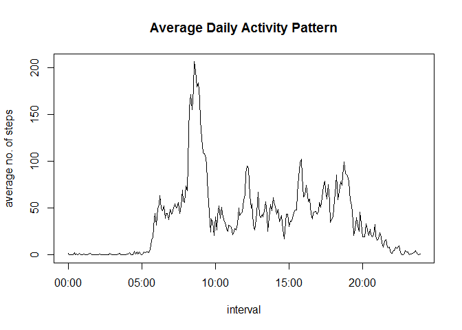

# Reproducible Research: Peer Assessment 1

The data used in this analysis consists of data from a personal activity monitoring device used by an anonymous individual during the months of October and November 2012 and include the number of steps taken in 5 minute intervals each day.

## Loading and preprocessing the data

Here is the code to load the data and convert the **interval** variable into a factor.


```r
activ <- read.csv("activity.csv")
activ$interval.t <- as.factor(activ$interval)
```

## What is mean total number of steps taken per day?

Using the __ddply__ function from the __plyr__ library, we can summarise the data and look at the total number of steps taken each day. We can also show the histogram of the total number of steps taken each day. This is done using the following code:


```r
library(plyr)
dailysum <- ddply(activ,~date,summarise,sumsteps=sum(steps))
hist(dailysum$sumsteps,main="Histogram of the total number of steps taken each day",xlab="Total number of steps taken each day")
```

 

Using the __mean__ and __median__ functions (and excluding the missing values for the moment) we can calculate that the mean number of steps taken each day is **10,766.19** and the median is **10,765**.

The code used is shown here:

```r
mean(dailysum$sumsteps,na.rm=T)
median(dailysum$sumsteps,na.rm=T)
```

## What is the average daily activity pattern?

Using the same __ddply__ function we can also look at the number of steps taken in each 5-minute interval, averaged across all days. We can then show a time-series plot for a 24-hr period. To do this we use the __strptime__ function to convert the **interval.t** variable to datetime for the time series x-axis. This is done using the following code:


```r
dailyavg <- ddply(activ,~interval.t,summarise,avgsteps=mean(na.omit(steps)))
dailyavg$interval.ts <- paste(substr(paste0("0000",as.character(dailyavg$interval.t)),nchar(as.character(dailyavg$interval.t))+1,nchar(as.character(dailyavg$interval.t))+2),substr(paste0("0000",as.character(dailyavg$interval.t)),nchar(as.character(dailyavg$interval.t))+3,nchar(as.character(dailyavg$interval.t))+4),sep=":")
plot(strptime(dailyavg$interval.ts,"%H:%M"),dailyavg$avgsteps,type="l",main="Average Daily Activity Pattern",xlab = "interval",ylab = "average no. of steps")
```

 

Looking at the time-series plot we can see that the 5-min interval where the maximum average number of steps are taken occurs at **08:35** where the average number of steps is **206.1698113**

The code to see the values stated above is shown here:


```r
dailyavg[dailyavg$avgsteps==max(dailyavg$avgsteps),]
```

## Inputing missing values

Until this moment we have been ignoring and excluding the missing values where we don't have a record of the number of steps taken. There are a total number of **2,304** rows that have missing data for **steps**. These occur during these dates: 2012-10-01, 2012-10-08, 2012-11-01, 2012-11-04, 2012-11-09, 2012-11-10, 2012-11-14, 2012-11-30. We can try to fill-in these missing values using the average number of steps taken at each 5-min interval rounded to the nearest integer. We will use the following code to do this:


```r
activfix <- read.csv("activity.csv")
activfix$interval.t <- as.factor(activfix$interval)
activfix[is.na(activfix$steps),1] <- round(dailyavg$avgsteps,0)
```

Now let's see how filling in these missing values affect the data, first we will look at how it affects the total number of steps taken each day. The following code will do this:


```r
dailysumfix <- ddply(activfix,~date,summarise,sumsteps=sum(steps))
par(mfrow=c(1,2))
hist(dailysum$sumsteps,main="ignore missing values",xlab="Total number of steps taken each day",ylim=c(0,35))
hist(dailysumfix$sumsteps,main="filled-in missing values",xlab="Total number of steps taken each day",ylim=c(0,35))
```

 

The mean number of steps taken each day will now be **10,765.64** (previously **10,766.19**) and the median will be **10,762** (previously **10,765**).

Filling in the missing values with the averages does not affect the mean and the median that much, and we can see from the histogram that the missing values are all added to the middle bar which is what we expect to see.

## Are there differences in activity patterns between weekdays and weekends?

Using the dataset with the filled-in missing values, we must first convert the **date** variable to a datetime format, and then use the __weekdays__ function to determine if the date is a weekday or a weekend and separate them into two datasets. The following code will do this:


```r
activfix$date.d <- as.Date(activfix$date,"%Y-%m-%d")
activfix$daytype <- ifelse(weekdays(activfix$date.d) %in% c("Saturday","Sunday"),"weekend","weekday")
activweekday <- activfix[activfix$daytype=="weekday",]
activweekend <- activfix[activfix$daytype=="weekend",]
```

We can now use __ddply__ on each dataset to get the average number of steps per 5-minute interval. This is shown by the following code: (note here that we don't need the na.omit option)


```r
weekdayavg <- ddply(activweekday,~interval.t,summarise,avgsteps=mean(steps))
weekdayavg$interval.ts <- paste(substr(paste0("0000",as.character(weekdayavg$interval.t)),nchar(as.character(weekdayavg$interval.t))+1,nchar(as.character(weekdayavg$interval.t))+2),substr(paste0("0000",as.character(weekdayavg$interval.t)),nchar(as.character(weekdayavg$interval.t))+3,nchar(as.character(weekdayavg$interval.t))+4),sep=":")
weekendavg <- ddply(activweekend,~interval.t,summarise,avgsteps=mean(steps))
weekendavg$interval.ts <- paste(substr(paste0("0000",as.character(weekendavg$interval.t)),nchar(as.character(weekendavg$interval.t))+1,nchar(as.character(weekendavg$interval.t))+2),substr(paste0("0000",as.character(weekendavg$interval.t)),nchar(as.character(weekendavg$interval.t))+3,nchar(as.character(weekendavg$interval.t))+4),sep=":")
```

The following code will now plot the average number of steps per 5-min interval, for the weekend and for weekdays.


```r
par(mfrow=c(2,1),mar=c(4,4,2,0.5))
plot(strptime(weekendavg$interval.ts,"%H:%M"),weekendavg$avgsteps,type="l",xlab = "interval (Weekend)",ylab = "average no. of steps")
plot(strptime(weekdayavg$interval.ts,"%H:%M"),weekdayavg$avgsteps,type="l",xlab = "interval (Weekday)",ylab = "average no. of steps")
```

 
